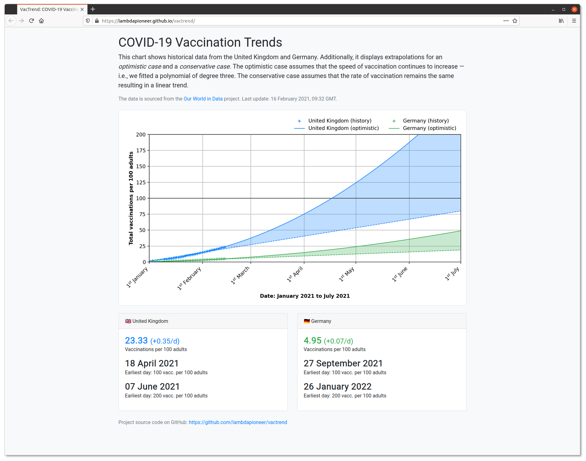

# VacTrend


This is a personal project for experimenting with GitHub Actions. As a side-effect, it creates a regularly updating website that shows historic data of COVID vaccinations in the UK and Germany along with some trend extrapolation.

Website: https://lambdapioneer.github.io/vactrend/

To run locally:

```
$ python -mvenv env
$ source env/bin/activate
(env)$ python -mpip install -r requirements.txt
(env)$ python main.py
(env)$ firefox public/index.html
```

Screenshot:

<a href="screenshot.png"></a>